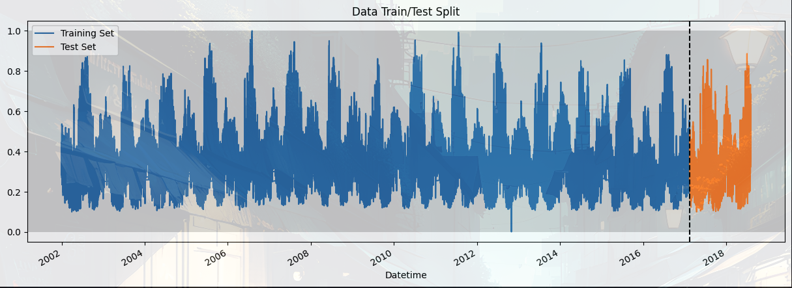
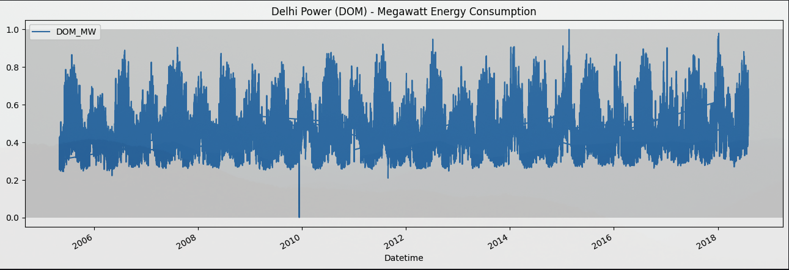
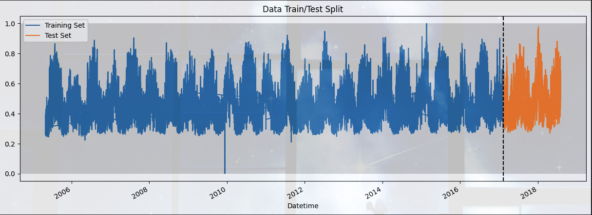

# Electro-AI

Electro AI is a deep learning model leveraging Recurrent Neural Networks (RNN) and Long Short-Term Memory (LSTM) networks to predict electricity consumption in Delhi. By incorporating key factors such as temperature, humidity, population growth, and real estate trends, the model delivers precise hourly, weekly, and yearly forecasts. Ideal for utility management, Electro AI optimizes power distribution, reduces outages, and enhances planning for energy providers. This model is designed to meet the challenges of dynamic urban environments, improving the efficiency and reliability of electricity supply.

## Dataset

There are Four Types of Dataset Available Right now:
1. AEP_hourly Energy Consumption Dataset from (2004-2018)
2. Delhi Power Consumption Dataset based on Multiple factors(2014-2024)
3. Dom_hourly Dataset Energy Consumption Dataset from (2004-2018)
4. PJME_hourly Dataset Energy Consumption Dataset from (2004-2018)

## Training And Testing

### PJME_Hourly

#### Energy Consumption Graph

#### Training
For the training of the Model We have taken data before 13-02-2017

#### Testing
For the testing of the Model We have taken Data after 13-02-2017

As you can see the partition line on the graph on the right side, the orange region is the Testing region.

### DOM_Hourly

#### Energy Consumption Graph

#### Training
For the training of the Model We have taken data before 13-02-2017

As you can see the partition line on the graph on the left side, the blue region is the training region.

#### Testing
For the testing of the Model We have taken Data after 13-02-2017

As you can see the partition line on the graph on the right side, the orange region is the Testing region.

## Models

1. **RNN (Recurrent Neural Network)**
    - A Recurrent Neural Network (RNN) is a type of neural network designed for sequential data, where connections form cycles, allowing it to retain information from previous inputs.
    - **Layers:** In our RNN model, using 7 layers provided the optimal balance for achieving high accuracy on both the DOM and PJME datasets.
    - **Epochs:** We found that 32 epochs provided the optimal balance for effective learning.
    - **Problem:** RNNs struggle with learning long-term dependencies due to the vanishing gradient problem, which LSTM networks address.

2. **LSTM (Long Short-Term Memory)**
    - Long Short-Term Memory (LSTM) is a specialized RNN variant that addresses the problem of long-term dependency by using memory cells.
    - **Layers:** In our LSTM model, using 7 layers provided the optimal balance for high accuracy.
    - **Epochs:** We found that 32 epochs provided the optimal balance for effective learning.

## Training Model

To check out the training model code:
- **PJME**
    - **LSTM:** The location of the training code is `/model/LSTM-RNN/model2.ipynb`, and the pkl file is in `/model/model(pickle)/lstmmodel2.pkl`.
    - **RNN:** The location of the training code is `model/RNN/model2.ipynb`, and the pkl file is in `/model/model(pickle)/rnnmodel2.pkl`.
- **DOM**
    - **LSTM:** The location of the training code is `/model/LSTM-RNN/model2.ipynb`, and the pkl file is in `/model/model(pickle)/lstmmodel.pkl`.
    - **RNN:** The location of the training code is `model/RNN/model2.ipynb`, and the pkl file is in `/model/model(pickle)/rnnmodel2.pkl`.

## Prediction And Accuracy

- **PJME**
    - **LSTM:** The accuracy of the LSTM model on the PJME dataset is **97.95110117136096**.
    - **RNN:** The accuracy of the RNN model on the PJME dataset is **94.60996141689058**.
- **DOM**
    - **LSTM:** The accuracy of the LSTM model on the DOM dataset is **95.79372168438101**.
    - **RNN:** The accuracy of the RNN model on the DOM dataset is **91.62029669157408**.

## Electro-AI Model Explanation

## Experience The Models

### Model Video

### Model Link 👇

[Electro-AI Streamlit App](https://electroai.streamlit.app/)
